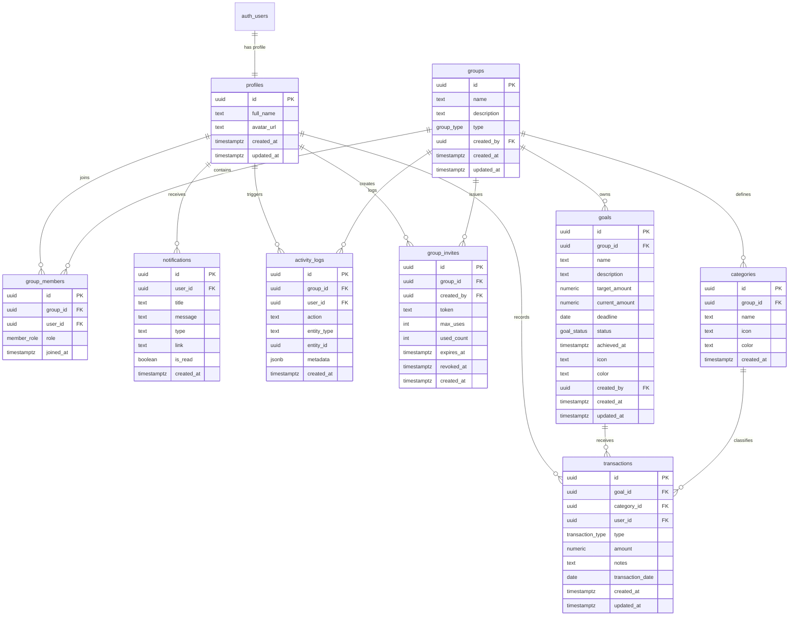

# 📘 BLUEPRINT SPESIFIKASI TEKNIS SISTEM WEB TABUNGAN
**Versi:** 1.0.0 (Design Baseline)  
**Status:** Approved Architectural Design  
**Stack Utama:** Next.js (App Router) + TypeScript + Supabase + Tailwind CSS / Vanilla CSS + Vercel  
**Prinsip Desain:** Free-First Architecture (Rp0 Operation Cost) & Enterprise-Grade Tenancy  

---

## DAFTAR ISI
1. [Problem & Background](#1-problem--background)
2. [Product Vision & Value Proposition](#2-product-vision--value-proposition)
3. [Target Users & Personas](#3-target-users--personas)
4. [User Stories (Epics)](#4-user-stories-epics)
5. [Core Use Cases](#5-core-use-cases)
6. [Product Scope & Roadmap (V1 - V3)](#6-product-scope--roadmap-v1---v3)
7. [Feature Specifications](#7-feature-specifications)
8. [Information Architecture & Sitemap](#8-information-architecture--sitemap)
9. [User Flow & State Lifecycle](#9-user-flow--state-lifecycle)
10. [Business Rules & Invariants (BR)](#10-business-rules--invariants-br)
11. [Entity Relationship Diagram (ERD)](#11-entity-relationship-diagram-erd)
12. [Database DDL, Constraints, & Triggers](#12-database-ddl-constraints--triggers)
13. [Row Level Security (RLS) & Authorization Matrix](#13-row-level-security-rls--authorization-matrix)
14. [Tech Stack & Architecture Decisions (ADR)](#14-tech-stack--architecture-decisions-adr)
15. [UI/UX Design Direction & Aesthetic Standards](#15-uiux-design-direction--aesthetic-standards)
16. [Responsive Strategy & Mobile-First Standards](#16-responsive-strategy--mobile-first-standards)
17. [Notification & Realtime Architecture](#17-notification--realtime-architecture)
18. [Validation & Input Sanitization](#18-validation--input-sanitization)
19. [Error, Empty, & Loading States Management](#19-error-empty--loading-states-management)
20. [Testing & Quality Assurance Strategy](#20-testing--quality-assurance-strategy)
21. [Security, Privacy, & Data Protection](#21-security-privacy--data-protection)
22. [Deployment & Free-Tier Optimization Strategy](#22-deployment--free-tier-optimization-strategy)
23. [Portfolio Showcase & Case Study Structure](#23-portfolio-showcase--case-study-structure)

---

## 1. Problem & Background

### 1.1 Permasalahan Utama
1. **Pencatatan Finansial Tercecer & Tidak Terarah:** Kebanyakan orang menabung tanpa memisahkan pos tujuan tabungan (semua uang bertumpuk di satu rekening), membuat motivasi dan pengukuran target kabur.
2. **Ketiadaan Solusi Tabungan Bersama Kasual:** Pasangan muda, keluarga kecil, atau rekan yang ingin patungan (liburan, kurban, sewa kontrakan) sering mengandalkan spreadsheet manual atau grup WhatsApp yang rawan selisih paham dan tidak transparan.
3. **Aplikasi Konvensional Terlalu Kompleks:** Aplikasi pencatatan keuangan yang ada umumnya terlalu rumit (*over-engineered*), penuh iklan, atau mewajibkan langganan berbayar (SaaS) hanya untuk fitur kolaborasi multi-user.
4. **Resiko Integritas Data Keuangan:** Tanpa sistem akuntansi atau *ledger-based calculation*, pencatatan manual sering memicu selisih saldo ketika ada transaksi yang diedit atau dibatalkan.

### 1.2 Solusi yang Dihadirkan
Sebuah aplikasi web berbasis **Workspace/Group** yang memadukan fleksibilitas pencatatan tabungan personal dengan transparansi tabungan bersama (*collaborative saving*). Sistem ini menyediakan pemisahan target (*Goals*), klasifikasi pos (*Categories*), jejak audit mutasi (*Activity Logs*), dan notifikasi real-time dengan biaya operasional nol rupiah (**Free-first architecture**).

---

## 2. Product Vision & Value Proposition

* **Visi Produk:** Menjadi platform pencatatan tabungan berbasis web yang paling intuitif, transparan, dan terpercaya bagi individu maupun kelompok tanpa biaya langganan seumur hidup.
* **Proposisi Nilai:**
  * **Unified Workspace:** Satu akun untuk tabungan pribadi sekaligus multi-grup kolaboratif tanpa perlu ganti akun.
  * **Absolute Data Integrity:** Perhitungan saldo otomatis berbasis mutasi riil (*single source of truth*) dengan proteksi di level database PostgreSQL.
  * **Zero-Cost Operation:** Didesain secara optimal untuk berjalan 100% pada *free tier* modern cloud (Vercel, Supabase, GitHub).
  * **Clean Collaboration:** Sistem undangan berbasis token berbatas waktu, role keamanan bertingkat, dan feed aktivitas yang transparan.

---

## 3. Target Users & Personas

### Persona 1: "The Solo Saver" (Dimas, 24 tahun, Fresh Graduate)
* **Tujuan:** Menabung untuk dana darurat Rp15 juta dan membeli laptop baru Rp12 juta.
* **Pain Point:** Sering tergoda membelanjakan uang di rekening karena tidak melihat visualisasi progres per pos target.
* **Kebutuhan:** Dashboard personal yang bersih, progress bar yang memotivasi, dan kemudahan mencatat setoran dari HP.

### Persona 2: "The Couple / Shared Planner" (Rian & Sarah, 28 tahun, Pasangan Menikah)
* **Tujuan:** Menabung bersama untuk DP Rumah Rp50 juta dan liburan akhir tahun Rp8 juta.
* **Pain Point:** Menggunakan Google Sheets yang ribet diedit di layar ponsel dan sering tidak tahu siapa yang terakhir menyetor.
* **Kebutuhan:** Ruang tabungan bersama yang bisa diakses berdua, realtime notifikasi saat pasangan menyetor, dan timeline aktivitas yang transparan.

### Persona 3: "The Social Group / Peer Circle" (Komunitas 4-6 Orang)
* **Tujuan:** Patungan sewa villa liburan tahun baru Rp6 juta.
* **Pain Point:** Butuh link undangan cepat tanpa registrasi rumit, butuh laporan siapa yang sudah setor berapa tanpa ada kecurigaan.
* **Kebutuhan:** Token invite sekali klik, rincian kontribusi per anggota, dan status target tercapai secara otomatis.

---

## 4. User Stories (Epics)

* **EPIC-01: Identity & Workspaces**
  * *US-01.1:* Sebagai user baru, saya ingin langsung mendapatkan workspace tabungan pribadi otomatis saat mendaftar sehingga saya bisa langsung menabung tanpa konfigurasi manual.
  * *US-01.2:* Sebagai user, saya ingin bisa membuat beberapa ruang tabungan bersama (Shared Group) untuk tujuan berbeda (misal: "Keluarga", "Trip Bali").
* **EPIC-02: Goal & Category Management**
  * *US-02.1:* Sebagai member grup, saya ingin membuat target tabungan (*Goal*) dengan nama, target nominal, tanggal target (deadline), dan ikon representatif.
  * *US-02.2:* Sebagai member grup, saya ingin mengelompokkan setoran ke dalam kategori pos (misal: "Gaji", "Bonus", "Side Hustle") agar sumber dana tercatat rapi.
* **EPIC-03: Transaction Ledger & Balance**
  * *US-03.1:* Sebagai member grup, saya ingin menyetor uang (*deposit*) atau menarik uang (*withdrawal*) ke dalam suatu goal spesifik.
  * *US-03.2:* Sebagai member grup, saya ingin bisa mengoreksi transaksi yang salah catat tanpa merusak total saldo goal.
* **EPIC-04: Collaboration & Security**
  * *US-04.1:* Sebagai owner grup, saya ingin membuat tautan undangan (*invite link*) dengan batas waktu dan kuota penggunaan untuk dibagikan ke partner.
  * *US-04.2:* Sebagai member grup, saya ingin melihat feed aktivitas grup untuk mengetahui siapa menyetor apa secara real-time.
* **EPIC-05: Milestone Celebration & Notification**
  * *US-05.1:* Sebagai anggota grup, saya ingin mendapatkan notifikasi lonceng in-app saat sebuah goal berhasil tercapai 100%.

---

## 5. Core Use Cases

| ID | Nama Use Case | Aktor Utama | Prekondisi | Alur Singkat |
|---|---|---|---|---|
| **UC-01** | Register & Auto Onboarding | Pengguna Baru | Belum terdaftar | User sign up -> Sistem membuat profile -> Sistem membuat personal group default -> Redirect ke dashboard. |
| **UC-02** | Create Financial Goal | Member Group | Memiliki akses ke grup | User input nama, nominal, deadline -> Sistem memvalidasi -> Goal aktif muncul di dashboard. |
| **UC-03** | Record Deposit Transaction | Member Group | Goal tersedia | User input nominal, pilih goal & category -> Sistem simpan transaksi -> Trigger DB menghitung ulang saldo -> Cek milestone. |
| **UC-04** | Record Withdrawal | Member Group | Goal memiliki saldo | User input nominal penarikan -> Validasi saldo cukup -> Saldo goal berkurang -> Tercatat di activity log. |
| **UC-05** | Generate & Share Invite | Group Owner | Terdaftar sebagai Owner | Owner set expiry & max uses -> Sistem generate secure token -> Link disalin & dibagikan. |
| **UC-06** | Accept Group Invitation | Calon Member | Memiliki token invite valid | User membuka link -> Sistem validasi kuota/kedaluwarsa -> User masuk ke `group_members` -> Notifikasi ke Owner. |
| **UC-07** | Reallocate Transaction | Pembuat Transaksi | Transaksi telah tercatat | User pindahkan transaksi dari Goal A ke Goal B -> Trigger mengoreksi saldo kedua goal secara atomik. |
| **UC-08** | In-App Realtime Alert | Member Group | Aktif di aplikasi | Transaksi baru masuk / goal tercapai -> Supabase Realtime trigger badge notifikasi lonceng tanpa refresh. |

---

## 6. Product Scope & Roadmap (V1 - V3)

```text
┌─────────────────────────┐     ┌─────────────────────────┐     ┌─────────────────────────┐
│       V1 — CORE         │     │   V2 — COLLABORATION    │     │  V3 — INTELLIGENCE      │
├─────────────────────────┤     ├─────────────────────────┤     ├─────────────────────────┤
│ • Auth & Profiles       │ ──► │ • Token-Based Invites   │ ──► │ • Saving Projections    │
│ • Personal Workspace    │     │ • Owner/Member Roles    │     │ • Trend Charts          │
│ • Shared Workspaces     │     │ • Activity Logs Feed    │     │ • Celebration FX        │
│ • Goal & Category CRUD  │     │ • Realtime In-App Bell  │     │ • Contribution Breakdown│
│ • Ledger Transactions   │     │ • Advanced Filters      │     │ • CSV Data Export       │
│ • Auto-Calc Balance DB  │     │ • Member Management     │     │ • PWA / Mobile Polish   │
└─────────────────────────┘     └─────────────────────────┘     └─────────────────────────┘
```

### V1 — Core (MVP Baseline)
* Autentikasi lengkap (Email/Password & Magic Link Supabase).
* Setup profil otomatis & inisiasi workspace personal.
* Pembuatan dan pergantian multi-workspace (*Personal & Shared*).
* Manajemen Goal (Target, Progress, Saldo, Deadline).
* Manajemen Kategori yang *scoped* per grup.
* Pencatatan transaksi deposit dan penarikan.
* Sinkronisasi saldo otomatis via PostgreSQL triggers.
* Proteksi Row Level Security (RLS) di seluruh tabel.

### V2 — Collaboration & Realtime
* Sistem undangan anggota berbasis tabel `group_invites` (tokenized, expiration, revocation, limit).
* Manajemen peran: `owner` (admin penuh) dan `member` (kontributor).
* Audit trail transparan via `activity_logs` (feed lini masa).
* In-App notification system dengan integrasi Supabase Realtime.
* Filter transaksi per tanggal, kategori, dan kontributor.
* Tampilan rincian kontribusi per anggota (*who contributed how much*).

### V3 — Intelligence & Experience Polish
* Proyeksi cerdas: estimasi waktu tercapainya target berdasarkan kecepatan menabung rata-rata.
* Rekomendasi nominal setoran bulanan yang diperlukan untuk mengejar deadline.
* Visualisasi grafik alokasi kategori & tren pertumbuhan tabungan.
* Animasi mikro & *confetti celebration* saat target tercapai.
* Fitur ekspor riwayat mutasi dalam format CSV.
* PWA (Progressive Web App) manifest untuk pengalaman instalasi layaknya aplikasi native.

---

## 7. Feature Specifications

### 7.1 Modul Autentikasi & Profil
* Didukung oleh Supabase Auth.
* Sesi disimpan dalam HTTP-Only Cookie yang aman via `@supabase/ssr`.
* Halaman registrasi, login, reset password, dan update avatar/nama.

### 7.2 Modul Workspace / Group
* Pengguna dapat berpindah antar workspace melalui dropdown di navigation bar.
* Workspace `personal` tidak memiliki fitur invite member dan role-nya permanen untuk si pemilik akun.
* Workspace `shared` memiliki nama, deskripsi, avatar, dan daftar anggota.

### 7.3 Modul Goals (Target Tabungan)
* Atribut: Nama, Deskripsi, Target Nominal, Saldo Terkini (*read-only cached*), Tanggal Target, Ikon, Warna, Status (`active`, `achieved`, `cancelled`), `achieved_at`.
* Status bar persentase visual: `(current_amount / target_amount) * 100%`.
* Indikator warna progress:
  * 0% - 49%: Netral / Biru
  * 50% - 99%: Oranye / Menjelang Target
  * 100%+: Hijau Emerald / Selesai

### 7.4 Modul Transaksi (Ledger Mutasi)
* Jenis: `deposit` (pemasukan tabungan) dan `withdrawal` (penarikan dana).
* Transaksi wajib terhubung ke 1 Goal dan 1 Kategori di grup yang sama.
* User dapat menambahkan catatan (*notes*) dan memilih tanggal mutasi.
* Transaksi dapat diedit atau dihapus oleh pemilik transaksi atau `owner` grup.

---

## 8. Information Architecture & Sitemap

```text
/ (Landing Page / Auth Guard)
├── /login
├── /register
├── /auth/callback (Supabase Auth SSR Exchange)
└── /app (Protected Layout)
    ├── /dashboard (Ringkasan Workspace Aktif)
    ├── /groups
    │   ├── /create (Form Buat Workspace Baru)
    │   └── /[groupId]
    │       ├── /goals
    │       │   ├── /create
    │       │   └── /[goalId] (Detail Goal, Progress, Mutasi Khusus Goal)
    │       ├── /categories (Kelola Pos Kategori Grup)
    │       ├── /transactions (Seluruh Mutasi Transaksi Grup)
    │       ├── /activity (Timeline Lini Masa Aktivitas)
    │       └── /settings (Kelola Member, Generate Invite, Ubah Info Grup)
    ├── /invite/[token] (Halaman Terima Undangan Grup)
    └── /settings/profile (Pengaturan Akun User)
```

---

## 9. User Flow & State Lifecycle

### 9.1 Alur Registrasi & Onboarding Otomatis
```text
User Register ──► auth.users ──► Trigger: on_auth_user_created
                                        │
                                        ├──► Buat record di profiles
                                        ├──► Buat default personal groups
                                        └──► Buat group_members (role: owner)
                                                    │
                                                    ▼
                                            Redirect ke /dashboard
```

### 9.2 Alur Transaksi & Sinkronisasi Saldo
```text
Input Form Transaksi ──► Validasi Zod (Client & Server)
                                    │
                                    ▼
                         INSERT transactions
                                    │
                         PostgreSQL Trigger trg_sync_goal_balance
                                    │
                      ┌─────────────┴─────────────┐
                      ▼                           ▼
            Hitung ulang SUM:           Cek Kondisi Milestone:
     deposit - withdrawal            current_amount >= target_amount
                      │                           │
                      ▼                           ▼
            Update goals.current_amount   Set status = 'achieved'
                                          Set achieved_at = NOW()
                                          Kirim in-app notification
```

### 9.3 Siklus Hidup Status Goal (*Goal State Machine*)
* **`active`**: Status bawaan saat dibuat. Saldo masih di bawah target.
* **`achieved`**: Dicapai ketika saldo pertama kali menyentuh atau melampaui target. `achieved_at` terkunci. Penarikan dana setelahnya tidak mengembalikan status ke `active`, menjaga catatan historis pencapaian.
* **`cancelled`**: Ditutup secara manual oleh pemilik jika tujuan tabungan dibatalkan.

---

## 10. Business Rules & Invariants (BR)

Daftar aturan bisnis formal yang menjadi patokan validasi aplikasi, database constraint, dan penulisan unit/integration test:

* **BR-001 (Single Goal Scope):** Satu transaksi mutasi hanya boleh terikat ke tepat satu `Goal`.
* **BR-002 (Same Group Invariant):** `Goal` dan `Category` yang dipilih pada suatu transaksi wajib berasal dari `group_id` yang identik. Tidak boleh ada transaksi silang workspace.
* **BR-003 (Workspace Boundary):** Pengguna hanya diizinkan membaca, menambah, atau mengubah data pada `Group` di mana ia tercatat aktif dalam tabel `group_members`.
* **BR-004 (Derived Balance Integrity):** Nilai `goals.current_amount` adalah murni hasil kalkulasi sistem database dari `SUM(deposit) - SUM(withdrawal)`. Klien/pengguna dilarang mengubah nilai ini secara langsung.
* **BR-005 (Milestone Persistence):** Penarikan dana (*withdrawal*) setelah suatu Goal mencapai status `'achieved'` tidak boleh menghapus status pencapaian maupun nilai `achieved_at`.
* **BR-006 (Ledger Audit Preservation):** Jika profil akun pengguna dihapus, catatan transaksi historis yang pernah ia buat di dalam grup tetap dipertahankan dengan mengubah `user_id` menjadi `NULL` (menampilkan label *"Deleted User"*).
* **BR-007 (Role Privilege Guard):** Hanya anggota ber-role `'owner'` yang memiliki wewenang untuk mengubah informasi grup, membuat invite token, mengeluarkan member, atau menghapus grup.
* **BR-008 (Invite Token Validity):** Tautan undangan grup ditolak jika telah melewati `expires_at`, telah di-`revoked_at`, atau telah mencapai batas `max_uses`.
* **BR-009 (No Overdraft/Negative Balance):** Transaksi penarikan (*withdrawal*) tidak boleh menyebabkan nilai `current_amount` pada goal menjadi minus (< 0).
* **BR-010 (Default Personal Invariant):** Setiap pengguna wajib memiliki minimal satu workspace bertipe `'personal'`. Workspace personal tidak dapat dihapus dan tidak dapat memiliki anggota tambahan.

---

## 11. Entity Relationship Diagram (ERD)



---

## 12. Database DDL, Constraints, & Triggers

Skrip SQL terstruktur untuk dieksekusi di Supabase SQL Editor:

```sql
-- ============================================================================
-- 1. ENUM TYPES
-- ============================================================================
CREATE TYPE group_type AS ENUM ('personal', 'shared');
CREATE TYPE member_role AS ENUM ('owner', 'member');
CREATE TYPE goal_status AS ENUM ('active', 'achieved', 'cancelled');
CREATE TYPE transaction_type AS ENUM ('deposit', 'withdrawal');

-- ============================================================================
-- 2. TABLES DEFINITIONS
-- ============================================================================

-- PROFILES (Ekstensi auth.users)
CREATE TABLE public.profiles (
    id UUID PRIMARY KEY REFERENCES auth.users(id) ON DELETE CASCADE,
    full_name TEXT NOT NULL,
    avatar_url TEXT,
    created_at TIMESTAMPTZ NOT NULL DEFAULT NOW(),
    updated_at TIMESTAMPTZ NOT NULL DEFAULT NOW()
);

-- GROUPS (Workspace Penampung)
CREATE TABLE public.groups (
    id UUID PRIMARY KEY DEFAULT gen_random_uuid(),
    name TEXT NOT NULL CHECK (char_length(trim(name)) > 0),
    description TEXT,
    type group_type NOT NULL DEFAULT 'personal',
    created_by UUID REFERENCES public.profiles(id) ON DELETE SET NULL,
    created_at TIMESTAMPTZ NOT NULL DEFAULT NOW(),
    updated_at TIMESTAMPTZ NOT NULL DEFAULT NOW()
);

-- GROUP MEMBERS
CREATE TABLE public.group_members (
    id UUID PRIMARY KEY DEFAULT gen_random_uuid(),
    group_id UUID NOT NULL REFERENCES public.groups(id) ON DELETE CASCADE,
    user_id UUID NOT NULL REFERENCES public.profiles(id) ON DELETE CASCADE,
    role member_role NOT NULL DEFAULT 'member',
    joined_at TIMESTAMPTZ NOT NULL DEFAULT NOW(),
    CONSTRAINT uq_group_member UNIQUE (group_id, user_id)
);

-- GROUP INVITES (Sistem Undangan Token)
CREATE TABLE public.group_invites (
    id UUID PRIMARY KEY DEFAULT gen_random_uuid(),
    group_id UUID NOT NULL REFERENCES public.groups(id) ON DELETE CASCADE,
    created_by UUID REFERENCES public.profiles(id) ON DELETE SET NULL,
    token TEXT NOT NULL UNIQUE DEFAULT encode(gen_random_bytes(24), 'hex'),
    max_uses INT NOT NULL DEFAULT 1 CHECK (max_uses > 0),
    used_count INT NOT NULL DEFAULT 0 CHECK (used_count >= 0),
    expires_at TIMESTAMPTZ NOT NULL,
    revoked_at TIMESTAMPTZ,
    created_at TIMESTAMPTZ NOT NULL DEFAULT NOW()
);

-- CATEGORIES (Scoped per group)
CREATE TABLE public.categories (
    id UUID PRIMARY KEY DEFAULT gen_random_uuid(),
    group_id UUID NOT NULL REFERENCES public.groups(id) ON DELETE CASCADE,
    name TEXT NOT NULL CHECK (char_length(trim(name)) > 0),
    icon TEXT DEFAULT 'tag',
    color TEXT DEFAULT '#3B82F6',
    created_at TIMESTAMPTZ NOT NULL DEFAULT NOW(),
    CONSTRAINT uq_group_category UNIQUE (group_id, name)
);

-- GOALS
CREATE TABLE public.goals (
    id UUID PRIMARY KEY DEFAULT gen_random_uuid(),
    group_id UUID NOT NULL REFERENCES public.groups(id) ON DELETE CASCADE,
    name TEXT NOT NULL CHECK (char_length(trim(name)) > 0),
    description TEXT,
    target_amount NUMERIC(15, 2) NOT NULL CHECK (target_amount > 0),
    current_amount NUMERIC(15, 2) NOT NULL DEFAULT 0.00 CHECK (current_amount >= 0),
    deadline DATE,
    status goal_status NOT NULL DEFAULT 'active',
    achieved_at TIMESTAMPTZ,
    icon TEXT DEFAULT 'target',
    color TEXT DEFAULT '#10B981',
    created_by UUID REFERENCES public.profiles(id) ON DELETE SET NULL,
    created_at TIMESTAMPTZ NOT NULL DEFAULT NOW(),
    updated_at TIMESTAMPTZ NOT NULL DEFAULT NOW()
);

-- TRANSACTIONS (Mutasi Finansial)
CREATE TABLE public.transactions (
    id UUID PRIMARY KEY DEFAULT gen_random_uuid(),
    goal_id UUID NOT NULL REFERENCES public.goals(id) ON DELETE CASCADE,
    category_id UUID NOT NULL REFERENCES public.categories(id) ON DELETE RESTRICT,
    user_id UUID REFERENCES public.profiles(id) ON DELETE SET NULL, -- Preservation: NULL saat user dihapus
    type transaction_type NOT NULL DEFAULT 'deposit',
    amount NUMERIC(15, 2) NOT NULL CHECK (amount > 0),
    notes TEXT,
    transaction_date DATE NOT NULL DEFAULT CURRENT_DATE,
    created_at TIMESTAMPTZ NOT NULL DEFAULT NOW(),
    updated_at TIMESTAMPTZ NOT NULL DEFAULT NOW()
);

-- ACTIVITY LOGS
CREATE TABLE public.activity_logs (
    id UUID PRIMARY KEY DEFAULT gen_random_uuid(),
    group_id UUID NOT NULL REFERENCES public.groups(id) ON DELETE CASCADE,
    user_id UUID REFERENCES public.profiles(id) ON DELETE SET NULL,
    action TEXT NOT NULL,
    entity_type TEXT NOT NULL,
    entity_id UUID,
    metadata JSONB NOT NULL DEFAULT '{}'::jsonb,
    created_at TIMESTAMPTZ NOT NULL DEFAULT NOW()
);

-- NOTIFICATIONS
CREATE TABLE public.notifications (
    id UUID PRIMARY KEY DEFAULT gen_random_uuid(),
    user_id UUID NOT NULL REFERENCES public.profiles(id) ON DELETE CASCADE,
    title TEXT NOT NULL,
    message TEXT NOT NULL,
    type TEXT NOT NULL DEFAULT 'info',
    link TEXT,
    is_read BOOLEAN NOT NULL DEFAULT FALSE,
    created_at TIMESTAMPTZ NOT NULL DEFAULT NOW()
);

-- ============================================================================
-- 3. BUSINESS LOGIC & TRIGGERS
-- ============================================================================

-- TRIGGER 1: Otomatisasi Setup User Baru
CREATE OR REPLACE FUNCTION public.handle_new_user()
RETURNS TRIGGER AS $$
DECLARE
    new_group_id UUID;
    user_name TEXT;
BEGIN
    user_name := COALESCE(new.raw_user_meta_data->>'full_name', split_part(new.email, '@', 1));
    
    -- 1. Buat Profile
    INSERT INTO public.profiles (id, full_name, avatar_url)
    VALUES (new.id, user_name, new.raw_user_meta_data->>'avatar_url');

    -- 2. Buat Default Personal Group
    INSERT INTO public.groups (name, description, type, created_by)
    VALUES ('Tabungan Pribadi', 'Ruang tabungan personal utama', 'personal', new.id)
    RETURNING id INTO new_group_id;

    -- 3. Daftarkan sebagai Owner
    INSERT INTO public.group_members (group_id, user_id, role)
    VALUES (new_group_id, new.id, 'owner');

    -- 4. Kategori Bawaan untuk Personal Group
    INSERT INTO public.categories (group_id, name, icon, color) VALUES
    (new_group_id, 'Alokasi Bulanan', 'wallet', '#3B82F6'),
    (new_group_id, 'Bonus & THR', 'gift', '#10B981'),
    (new_group_id, 'Sisa Belanja', 'piggy-bank', '#F59E0B');

    RETURN new;
END;
$$ LANGUAGE plpgsql SECURITY DEFINER;

CREATE TRIGGER trg_on_auth_user_created
    AFTER INSERT ON auth.users
    FOR EACH ROW EXECUTE FUNCTION public.handle_new_user();

-- TRIGGER 2: Sinkronisasi Saldo Goal (Calculated Balance) & Cek Milestone
CREATE OR REPLACE FUNCTION public.sync_goal_balance()
RETURNS TRIGGER AS $$
DECLARE
    target_goal_id UUID;
    total_balance NUMERIC(15, 2);
    g_target NUMERIC(15, 2);
    g_status goal_status;
    g_achieved_at TIMESTAMPTZ;
    g_name TEXT;
    g_group_id UUID;
BEGIN
    IF TG_OP = 'DELETE' THEN
        target_goal_id := OLD.goal_id;
    ELSE
        target_goal_id := NEW.goal_id;
    END IF;

    -- Hitung Saldo Riil: SUM(deposit) - SUM(withdrawal)
    SELECT COALESCE(SUM(
        CASE 
            WHEN type = 'deposit' THEN amount 
            WHEN type = 'withdrawal' THEN -amount 
            ELSE 0 
        END
    ), 0.00)
    INTO total_balance
    FROM public.transactions
    WHERE goal_id = target_goal_id;

    -- Validasi Tidak Boleh Negatif (BR-009)
    IF total_balance < 0 THEN
        RAISE EXCEPTION 'Saldo tidak mencukupi untuk penarikan ini. Saldo akhir tidak boleh negatif.';
    END IF;

    -- Ambil Data Goal Terkini
    SELECT target_amount, status, achieved_at, name, group_id
    INTO g_target, g_status, g_achieved_at, g_name, g_group_id
    FROM public.goals
    WHERE id = target_goal_id;

    -- Logika Milestone: Jika mencapai target dan belum pernah achieved (BR-005)
    IF total_balance >= g_target AND g_achieved_at IS NULL THEN
        UPDATE public.goals
        SET current_amount = total_balance,
            status = 'achieved',
            achieved_at = NOW(),
            updated_at = NOW()
        WHERE id = target_goal_id;

        -- Kirim Notifikasi ke Seluruh Member Grup
        INSERT INTO public.notifications (user_id, title, message, type, link)
        SELECT gm.user_id,
               'Target Tercapai! 🎉',
               'Goal "' || g_name || '" telah berhasil mencapai target 100%!',
               'goal_reached',
               '/groups/' || g_group_id || '/goals/' || target_goal_id
        FROM public.group_members gm
        WHERE gm.group_id = g_group_id;

    ELSE
        -- Update Saldo Reguler (Status achieved tetap dipertahankan)
        UPDATE public.goals
        SET current_amount = total_balance,
            updated_at = NOW()
        WHERE id = target_goal_id;
    END IF;

    -- Jika terjadi UPDATE dan goal_id dipindahkan (Reallocate)
    IF TG_OP = 'UPDATE' AND OLD.goal_id <> NEW.goal_id THEN
        -- Hitung ulang untuk OLD.goal_id
        SELECT COALESCE(SUM(
            CASE WHEN type = 'deposit' THEN amount WHEN type = 'withdrawal' THEN -amount ELSE 0 END
        ), 0.00)
        INTO total_balance
        FROM public.transactions
        WHERE goal_id = OLD.goal_id;

        UPDATE public.goals
        SET current_amount = total_balance,
            updated_at = NOW()
        WHERE id = OLD.goal_id;
    END IF;

    RETURN NULL;
END;
$$ LANGUAGE plpgsql SECURITY DEFINER;

CREATE TRIGGER trg_after_transaction_mutation
    AFTER INSERT OR UPDATE OR DELETE ON public.transactions
    FOR EACH ROW EXECUTE FUNCTION public.sync_goal_balance();
```

---

## 13. Row Level Security (RLS) & Authorization Matrix

Supabase mewajibkan RLS aktif pada skema `public` agar data tidak bocor antar pengguna.

### 13.1 Helper Function untuk RLS (Mencegah Infinite Recursion)
```sql
-- Helper mengecek keanggotaan grup secara efisien
CREATE OR REPLACE FUNCTION public.is_group_member(lookup_group_id UUID, lookup_user_id UUID)
RETURNS BOOLEAN AS $$
    SELECT EXISTS (
        SELECT 1 FROM public.group_members
        WHERE group_id = lookup_group_id AND user_id = lookup_user_id
    );
$$ LANGUAGE sql SECURITY DEFINER STABLE;

-- Helper mengecek role owner
CREATE OR REPLACE FUNCTION public.is_group_owner(lookup_group_id UUID, lookup_user_id UUID)
RETURNS BOOLEAN AS $$
    SELECT EXISTS (
        SELECT 1 FROM public.group_members
        WHERE group_id = lookup_group_id AND user_id = lookup_user_id AND role = 'owner'
    );
$$ LANGUAGE sql SECURITY DEFINER STABLE;
```

### 13.2 Matriks Kebijakan RLS

| Tabel | Operasi | Kriteria Keamanan / Policy Condition |
|---|---|---|
| **`profiles`** | SELECT | Terbuka untuk semua user terotentikasi (`auth.role() = 'authenticated'`). |
| | UPDATE | Hanya pemilik profil (`id = auth.uid()`). |
| **`groups`** | SELECT | Anggota grup (`public.is_group_member(id, auth.uid())`). |
| | INSERT | User terotentikasi (`auth.uid() = created_by`). |
| | UPDATE/DELETE | Hanya Owner grup (`public.is_group_owner(id, auth.uid())`). |
| **`group_members`** | SELECT | Anggota grup yang sama (`public.is_group_member(group_id, auth.uid())`). |
| | INSERT/DELETE | Hanya Owner grup (`public.is_group_owner(group_id, auth.uid())`) ATAU user keluar sendiri. |
| **`group_invites`** | SELECT/INSERT | Hanya Owner grup. (SELECT publik hanya via secure RPC function saat redeem token). |
| **`categories`** | ALL | Anggota grup (`public.is_group_member(group_id, auth.uid())`). |
| **`goals`** | SELECT/INSERT/UPDATE | Anggota grup (`public.is_group_member(group_id, auth.uid())`). |
| | DELETE | Hanya Owner grup atau pembuat goal. |
| **`transactions`** | SELECT/INSERT | Anggota grup terkait goal (`public.is_group_member((SELECT group_id FROM goals WHERE id = goal_id), auth.uid())`). |
| | UPDATE/DELETE | Pemilik transaksi (`user_id = auth.uid()`) atau Owner grup. |
| **`activity_logs`** | SELECT | Anggota grup (`public.is_group_member(group_id, auth.uid())`). |
| | INSERT | Server-side / Trigger saja (Klien dilarang INSERT langsung). |
| **`notifications`** | ALL | Hanya penerima (`user_id = auth.uid()`). |

---

## 14. Tech Stack & Architecture Decisions (ADR)

* **Framework:** **Next.js 15 (App Router)** + React 19 + TypeScript.
  * *Alasan:* Server Component menghemat pengiriman JavaScript ke browser, routing berbasis folder intuitif, dan integrasi mulus dengan Vercel.
* **Database & Auth:** **Supabase (PostgreSQL 15)**.
  * *Alasan:* Free tier sangat generous (500MB DB, 50k MAU), menyediakan Auth, Row Level Security, Triggers, dan engine Realtime WebSocket bawaan tanpa perlu server Node.js terpisah.
* **Client Data Fetching & Auth Guard:** `@supabase/ssr`.
  * *Alasan:* Mengelola session exchange token menggunakan HttpOnly cookie aman di Next.js Server Components, Server Actions, dan Middleware.
* **Styling & Design System:** **Tailwind CSS + Lucide Icons + Class Variance Authority (CVA)**.
  * *Alasan:* Utilitas fleksibel tanpa runtime overhead, mudah mematuhi aturan *anti-slop* dan standardisasi token visual.
* **Form & Validation:** **React Hook Form + Zod**.
  * *Alasan:* Skema validasi tunggal dapat digunakan ulang di sisi klien maupun Server Action.

---

## 15. UI/UX Design Direction & Aesthetic Standards

Mengikuti instruksi ketat panduan visual anti-slop:

1. **Color Palette Berkarakter:**
   * Menghindari warna default yang monoton (bukan plain blue/green).
   * Gunakan palet bertema *Slate & Emerald Wealth*:
     * Background: `#0B0F19` (Dark) / `#F8FAFC` (Light)
     * Surface/Card: `#111827` (Dark) / `#FFFFFF` (Light)
     * Primary Accent: Emerald Modern (`#10B981` / `#059669`) melambangkan pertumbuhan tabungan.
     * Accent Secondary: Indigo/Violet (`#6366F1`) untuk elemen interaktif grup.
     * Border & Divider: `#1F2937` (Dark) / `#E2E8F0` (Light) dengan kontras tegas.
2. **Tipografi:** Google Fonts **Outfit** (Heading) dipadukan dengan **Inter** atau **Plus Jakarta Sans** (Body & Angka Finansial).
3. **Komponen Finansial Visual:**
   * Angka nominal selalu diformat rapi dalam Rupiah (e.g., `Rp 12.500.000`).
   * Progress bar dengan animasi *fill transition* halus dan badge persentase yang kontras.
   * Kartu Goal memiliki aksen glow subtil saat mendekati target.
4. **Micro-interactions:**
   * Feedback visual instan saat menyetor uang (*toast alert* + pembaruan saldo mulus).
   * Lencana lonceng bergetar halus saat menerima event realtime baru.

---

## 16. Responsive Strategy & Mobile-First Standards

1. **Pencatatan Cepat Mobile (Thumb Zone):**
   * Floating Action Button (FAB) atau tombol aksi utama "Setor Cepat" berada di area jangkauan jempol bawah layar pada perangkat ponsel.
2. **Sheet / Drawer vs Modal:**
   * Pada resolusi mobile (`< 768px`), form transaksi muncul sebagai *Bottom Sheet* yang dapat di-swipe.
   * Pada resolusi desktop (`>= 768px`), form tampil sebagai modal dialog di tengah layar.
3. **Viewport & Form Guard:**
   * Ukuran target ketukan minimal `44px x 44px`.
   * Ukuran font input form minimal `16px` untuk mencegah auto-zoom liar pada browser Safari iOS.
   * Tabel transaksi bertransformasi menjadi kartu mutasi ringkas (*card list*) saat diakses dari layar ponsel.

---

## 17. Notification & Realtime Architecture

```text
Browser Client (User A)                    Supabase Realtime Engine
       │                                              │
       ├────── Subscribe channel: ───────────────────►│
       │       "public:notifications:user_id=eq.{id}" │
       │                                              │
       │                                 [User B menyetor dana di grup]
       │                                              │
       │                                 Trigger menghasilkan record baru
       │                                 di tabel public.notifications
       │                                              │
       │◄───── Event: INSERT (Payload notifikasi) ────┤
       │
   Navbar Bell Badge counter ++
   Sound chime halus + Toast Banner
```

* **Optimistic Counter:** Indikator badge lonceng bertambah secara instan.
* **Payload:** Berisi `title`, `message`, `link`, dan `created_at` untuk navigasi langsung ke halaman target terkait.

---

## 18. Validation & Input Sanitization

* **Nominal Transaksi & Target:**
  * Wajib berupa angka positif lebih dari nol (`amount > 0`).
  * Maksimal input transaksi disesuaikan dengan batasan `NUMERIC(15, 2)` (hingga ratusan triliun).
* **Sanitisasi Teks:**
  * Input nama goal, nama grup, dan catatan transaksi di-trim dari whitespace berlebih dan disanitasi dari karakter skrip berbahaya (XSS Prevention).
* **Deadline Goal:**
  * Wajib bertanggal di masa depan (tidak boleh memilih tanggal kemarin saat membuat target baru).

---

## 19. Error, Empty, & Loading States Management

* **Skeleton Loading:**
  * Tidak menggunakan spinner layar penuh. Gunakan *skeleton placeholder* berbentuk kartu dan progress bar yang berdenyut (*pulse*) saat data sedang diambil.
* **Empty States Informatif:**
  * Jika belum ada goal: Tampilkan ilustrasi celengan kosong dengan ajakan: *"Mulai langkah finansialmu dengan membuat target tabungan pertamamu."* disertai tombol CTA *"Buat Target Baru"*.
  * Jika belum ada transaksi: Tampilkan instruksi singkat cara menyetor dana.
* **Error Boundaries:**
  * Penanganan gagal koneksi dengan tombol *"Coba Lagi"* (*retry button*) yang elegan tanpa merusak tata letak halaman.

---

## 20. Testing & Quality Assurance Strategy

1. **Database & RLS Testing:**
   * Pengujian skenario RLS: User A mencoba melakukan SELECT atau UPDATE pada transaksi milik Grup B di mana User A bukan anggota -> Hasil wajib ditolak (0 rows returned / permission denied).
2. **Business Logic Unit Testing:**
   * Perhitungan kalkulasi formula: `SUM(deposit) - SUM(withdrawal)`.
   * Pengetesan batas toleransi floating-point matematika (menggunakan tipe data `NUMERIC`/`DECIMAL` untuk mencegah error presisi khas `FLOAT`).
3. **End-to-End (E2E) Flow Testing:**
   * Skenario Onboarding: Register -> Pembuatan Goal -> Deposit Rp500.000 -> Saldo terupdate -> Notifikasi muncul.

---

## 21. Security, Privacy, & Data Protection

* **Prinsip Least Privilege:** Seluruh API route dan operasi data dijalankan di bawah konteks token pengguna (`anon` key + user session), tidak mengekspos `service_role` key ke sisi klien browser.
* **Pencegahan Data Tampering:** Kolom `current_amount` tidak memiliki endpoint update dari klien; database triggers bertindak sebagai benteng pertahanan mutlak.
* **CSRF & Session Hijacking:** Proteksi token cookie bertipe `SameSite=Lax` dan `Secure` yang dikelola secara native oleh `@supabase/ssr`.

---

## 22. Deployment & Free-Tier Optimization Strategy

Arsitektur dirancang untuk biaya operasional **Rp 0 (Selamanya)**:

| Layanan | Peran | Alokasi Kuota Free Tier |
|---|---|---|
| **Vercel** | Frontend Hosting & Serverless Functions | 100 GB Bandwidth, Unlimited Deployments, Fast Global Edge CDN. |
| **Supabase** | PostgreSQL DB, Auth, & Realtime | 500 MB Storage, 50.000 Monthly Active Users (MAU), 200 Realtime Concurrent Connections. |
| **GitHub** | Version Control & CI/CD Actions | Repositori publik/privat gratis, automated build testing. |

---

## 23. Portfolio Showcase & Case Study Structure

Rangkaian penyajian project ini untuk bahan portofolio dan wawancara teknis:

1. **The Pitch (STAR Method):**
   * **Situation:** Ketiadaan aplikasi tabungan bersama yang gratis, transparan, dan terstruktur tanpa kompleksitas berlebih.
   * **Task:** Membangun platform web tabungan full-stack multi-workspace dengan integritas data setara standar perbankan.
   * **Action:** Menerapkan model arsitektur data terpadu (Unified Workspace), pemisahan Goal vs Category, Row Level Security bertingkat di PostgreSQL, dan kalkulasi saldo otomatis via triggers.
   * **Result:** Aplikasi produksi berkinerja tinggi, responsif di segala perangkat, aman, dan berbiaya operasional Rp0.
2. **Highlight Arsitektur Teknikal:**
   * Penjelasan *Trigger-based ledger balance calculation*.
   * Penjelasan skema *Token-based group invite with security revocation*.
   * Matriks perbandingan kecepatan query berkat *denormalized cached current_amount* yang dijaga oleh database triggers.
